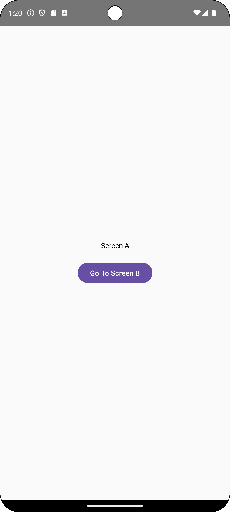

## Kullanım

Bu proje, Jetpack Compose ve Navigation Component kullanarak basit bir ekranlar arası navigasyon örneği sunar. 

Uygulamayı yerel olarak çalıştırmak için Android Studio'da projeyi açın ve emülatörde veya bir cihazda çalıştırın.

## Notlar

- Uygulama içindeki ekran rotaları `Routes` objesi üzerinden yönetilir.
- Her bir ekran, ayrı bir Composable fonksiyonu olarak oluşturulmuştur.
- `NavController.navigate` fonksiyonu ile ekranlar arası geçişler yapılmıştır.
- Ekran B'ye geçiş yaparken bir parametre iletilir.

## **Screen A & Screen B**

 

